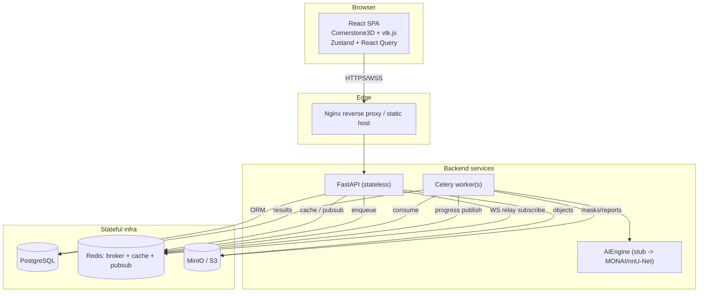

# 1. Architecture & Folder Structure

AI-AutoContour is a service-oriented monorepo. Each concern (web SPA, API, async worker, AI
engine) is independently deployable but shares contracts through typed schemas.

## High-level architecture



## Why this shape

- **Stateless API + stateful infra** -> horizontal scaling of API/worker pods independently.
- **Celery for AI** -> long-running GPU inference never blocks request threads.
- **Redis pub/sub** -> decouples worker progress from the WebSocket connection (any API
  replica can relay any job's progress; collaboration-ready).
- **S3/MinIO** -> imaging data and derived artifacts live in object storage, not the DB.
- **AIEngine protocol** -> the pipeline depends on an interface, not a model, so the stub
  and the real model are interchangeable.

## Folder structure

```
ai-autocontour/
├── README.md
├── .env.example
├── docker-compose.yml
├── docs/                         # the 13 deliverables
├── infra/
│   ├── backend.Dockerfile
│   ├── frontend.Dockerfile
│   ├── nginx.conf
│   └── entrypoint.sh             # migrate + launch
├── backend/
│   ├── pyproject.toml
│   ├── alembic.ini
│   ├── alembic/                  # migrations
│   └── app/
│       ├── main.py               # FastAPI entrypoint
│       ├── core/                 # config, security, logging, redis
│       ├── db/                   # session, base, init, seed
│       ├── models/               # SQLAlchemy ORM models
│       ├── schemas/              # Pydantic DTOs
│       ├── api/
│       │   ├── deps.py           # auth/role dependencies
│       │   └── routers/          # auth, studies, uploads, jobs, findings,
│       │                         #   segmentations, annotations, reports, ws
│       ├── services/             # storage (S3), dicom, reports
│       ├── ai/                   # engine.py (Protocol) + stub.py
│       └── workers/
│           ├── celery_app.py
│           └── tasks/            # pipeline stages
└── frontend/
    ├── package.json
    ├── vite.config.ts
    ├── tailwind.config.js
    ├── index.html
    └── src/
        ├── main.tsx, App.tsx
        ├── lib/                  # api client, query client, ws
        ├── store/                # zustand stores
        ├── api/                  # react-query hooks
        ├── components/layout/    # TopBar, LeftSidebar, panels
        ├── features/             # viewer, upload, studies, findings, reports, auth
        └── types/
```

## Deployment topology (target)

- Dev: `docker-compose` (this repo).
- Prod: Kubernetes — API `Deployment` + `HPA`, worker `Deployment` (GPU node pool),
  managed Postgres, managed Redis, S3 bucket, object/static hosting + CDN for the SPA.
  See [08-deployment.md](08-deployment.md).
