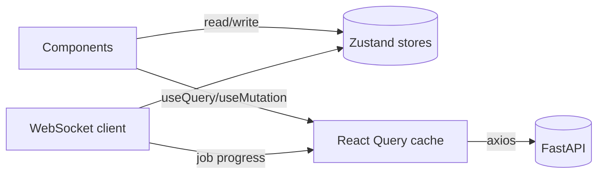

# 2. Frontend Architecture

A single-page React application that presents a radiologist workspace.

## Stack

| Concern | Choice |
|---------|--------|
| Framework | React 18 + TypeScript |
| Build | Vite |
| Styling | TailwindCSS (dark theme tokens) |
| Client state | Zustand |
| Server state | TanStack React Query |
| HTTP | Axios (typed client + interceptors) |
| Imaging 2D | Cornerstone3D (`@cornerstonejs/core`, `tools`, dicom-image-loader) |
| Imaging 3D | vtk.js (volume rendering) |
| Routing | React Router |

## State strategy

- **Server state** (studies, findings, reports, jobs) lives in React Query — cached,
  deduped, invalidated on mutation.
- **Client/UI state** (active tool, window/level, selected finding, layout) lives in
  Zustand stores under `src/store/`.
- **Auth tokens** persist in `localStorage` and are injected by an Axios interceptor;
  401s trigger a refresh-then-retry, then logout.



## Layout (the workspace shell)

```
┌────────────────────────────────────────────────────────────┐
│ TopBar: brand · study title · global actions · user menu     │
├──────────┬─────────────────────────────────┬────────────────┤
│ Left     │                                 │ AI Findings     │
│ Sidebar  │        Main Viewer Area         │ Panel           │
│ (studies,│   (Axial / Coronal / Sagittal   │ + auto          │
│  series, │    MPR + tools, 3D panel)        │   annotations   │
│  tools)  │                                 ├────────────────┤
│          │                                 │ Report Panel    │
└──────────┴─────────────────────────────────┴────────────────┘
```

Implemented as `components/layout/AppShell.tsx` composing `TopBar`, `LeftSidebar`,
`ViewerArea`, `FindingsPanel`, `ReportPanel`.

## Folder structure (`frontend/src`)

```
lib/            apiClient.ts, queryClient.ts, ws.ts, cornerstoneInit.ts
store/          authStore.ts, viewerStore.ts, uiStore.ts
api/            auth.ts, studies.ts, jobs.ts, findings.ts, reports.ts  (react-query hooks)
types/          domain types mirroring backend schemas
components/
  layout/       AppShell, TopBar, LeftSidebar, FindingsPanel, ReportPanel
  ui/           Button, Panel, Spinner, Badge, ...
features/
  auth/         LoginPage
  studies/      StudyList, StudyUpload
  viewer/       ViewerArea, Viewport, ToolBar, VolumePanel
  findings/     FindingCard, FindingsList
  reports/      ReportControls
```

## Cornerstone3D integration

`lib/cornerstoneInit.ts` initializes the core + tools + the DICOM image loader once at
app start. The viewer creates a `RenderingEngine` with three viewports (axial / coronal /
sagittal) backed by a shared volume, registers a `ToolGroup`, and loads frames via
presigned MinIO URLs (WADO-URI style `wadouri:` scheme). See [07-viewer.md](07-viewer.md).

## Build & quality

- `npm run dev` / `npm run build` / `npm run preview`
- `npm run typecheck` (tsc) and `npm run lint` (eslint) run in CI.
