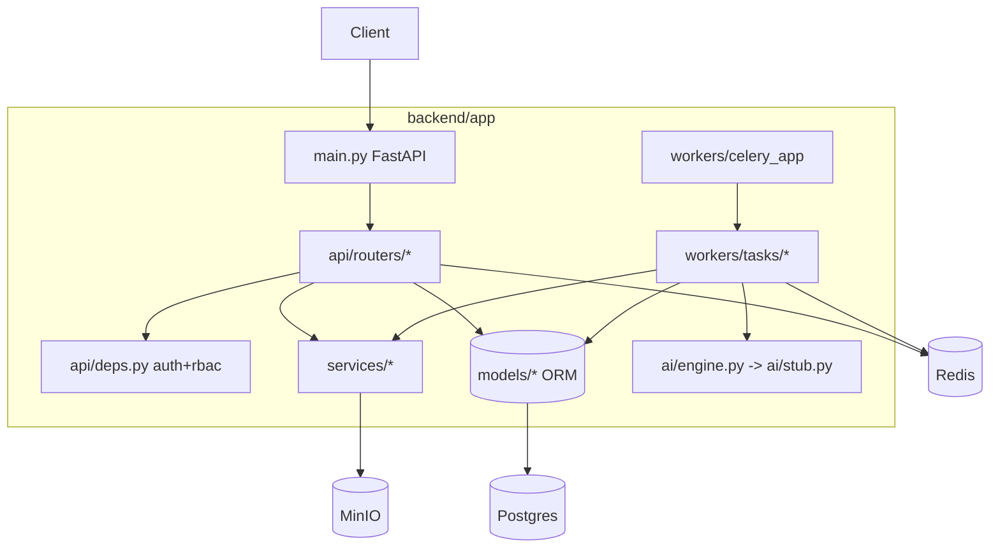

# 3. Backend Architecture

One Python package, two runtime entrypoints sharing the same models, schemas and
services:

- **API** — `uvicorn app.main:app` (FastAPI, stateless, request/response + WebSocket).
- **Worker** — `celery -A app.workers.celery_app worker` (async AI pipeline).

This is the standard Celery pattern: one image, two commands. Models are defined once and
imported by both.

## Layers

| Layer | Path | Responsibility |
|-------|------|----------------|
| Core | `app/core` | settings (pydantic-settings), JWT security, logging, redis client |
| DB | `app/db` | engine/session, declarative base, init + seed |
| Models | `app/models` | SQLAlchemy ORM entities |
| Schemas | `app/schemas` | Pydantic request/response DTOs |
| API | `app/api` | routers + dependency-injected auth/RBAC |
| Services | `app/services` | S3 storage, DICOM parsing, report rendering |
| AI | `app/ai` | `AIEngine` protocol + stub implementation |
| Workers | `app/workers` | Celery app + pipeline tasks |

## Configuration

`app/core/config.py` uses `pydantic-settings`; all config comes from environment variables
(12-factor). A single `settings` object is imported everywhere and assembles derived
values (`DATABASE_URL`, `REDIS_URL`, CORS list).

## Auth & RBAC

- JWT access + refresh tokens (`app/core/security.py`).
- `app/api/deps.py` exposes `get_current_user` and `require_roles(...)` dependencies.
- Roles: `admin`, `radiologist`, `technician`, `viewer`.

## Async pipeline

The API never runs inference. `POST /studies/{id}/analyze` creates a `processing_jobs`
row and dispatches a Celery `chain`. Each stage updates the job and publishes progress to
Redis; the API's WebSocket endpoint subscribes and relays to the browser. See
[06-ai-pipeline.md](06-ai-pipeline.md).

## Error handling & observability

- Consistent JSON errors via FastAPI exception handlers.
- Structured logging (`app/core/logging.py`).
- Health endpoints: `/health` (liveness) and `/health/ready` (DB + Redis + S3 checks).
- Flower for Celery task introspection in dev.
