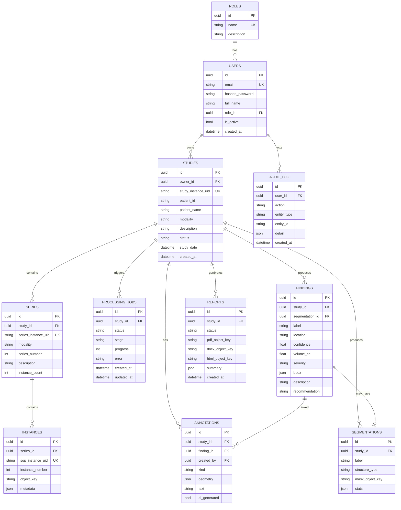

# 4. Database Schema

PostgreSQL, modeled with SQLAlchemy 2.0 (typed `Mapped[]`) and migrated with Alembic.
Primary keys are UUIDs. Timestamps are timezone-aware. The DICOM hierarchy
(Study -> Series -> Instance) is modeled explicitly.

## ER diagram

## Key tables

- **studies / series / instances** — mirror DICOM. `object_key` on instances points to the
  raw `.dcm` in MinIO; series carries modality + counts for fast listing.
- **processing_jobs** — single source of truth for pipeline progress. `stage` is one of
  `validate | extract_metadata | store | detect | segment | annotate | findings | report |
  done | failed`; `progress` is 0-100.
- **findings** — structured AI output: label, anatomical `location`, `confidence` (0-1),
  `volume_cc`, `severity`, `bbox` (image coords), free-text `description` + `recommendation`.
- **segmentations** — one row per segmented structure; `mask_object_key` references the
  derived mask (NIfTI/PNG) in MinIO; `stats` holds volume/voxel data.
- **annotations** — user-editable geometry (`kind`: text/bbox/polygon/brush). `ai_generated`
  distinguishes auto-annotations from manual edits; `finding_id` links back to a finding.
- **reports** — generated artifacts; one row produces 3 formats.

## Status enums

- `studies.status`: `uploaded | processing | analyzed | reported | error`
- `processing_jobs.status`: `queued | running | completed | failed`
- `reports.status`: `pending | generating | ready | failed`

## Migrations

Alembic autogenerate; the initial migration creates all tables + the role/admin seed runs
on startup (`app/db/seed.py`). Object data never lives in Postgres — only keys.
