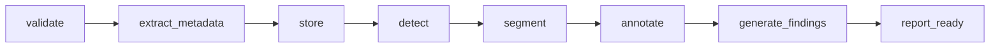
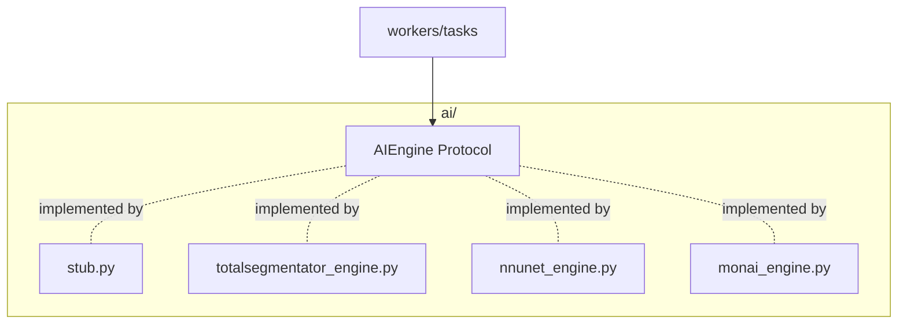

# 6. AI Pipeline Architecture

The pipeline turns a stored study into findings, segmentations and auto-annotations. It
runs entirely in Celery workers and is built around the `AIEngine` **protocol** so the
stub (iteration 1) and real models (later) are drop-in interchangeable.

## Stages



| Stage | Input | Output | Implementation |
|-------|-------|--------|----------------|
| validate | uploaded bytes | accept/reject | pydicom can-read check |
| extract_metadata | DICOM | patient/study/series tags | `services/dicom.py` |
| store | DICOM + derived | object keys | `services/storage.py` (MinIO) |
| detect | volume | bbox + label + confidence | `AIEngine.detect()` |
| segment | volume + detections | masks + volume stats | `AIEngine.segment()` |
| annotate | detections + masks | annotation rows (`ai_generated=true`) | task |
| generate_findings | detections + stats | `findings` rows + recommendation | task |
| report_ready | all results | mark study `analyzed` | task |

Each stage updates the `processing_jobs` row (`stage`, `progress`) and publishes a JSON
progress event to the Redis channel `job:{job_id}`.

## The AIEngine contract

```python
class Detection(TypedDict):
    label: str
    location: str
    confidence: float      # 0..1
    bbox: list[float]      # [x, y, z?, w, h, d?]
    severity: str

class SegmentationResult(TypedDict):
    label: str
    structure_type: str    # organ | tumor | lesion | bone | vessel
    mask: np.ndarray | bytes
    stats: dict            # volume_cc, voxel_count, ...

class AIEngine(Protocol):
    def detect(self, volume, meta) -> list[Detection]: ...
    def segment(self, volume, detections, meta) -> list[SegmentationResult]: ...
```

- `app/ai/stub.py` implements this deterministically: it picks plausible findings based on
  modality/body-part (e.g. CT chest -> "Lung Nodule, Right Upper Lobe, 0.92, 1.8cc";
  brain MRI -> "Brain Tumor, Left Frontal Lobe, 0.96, 14.2cc") and emits synthetic masks.
- Swapping in production = implement the same protocol with MONAI / nnU-Net /
  TotalSegmentator and bind it in `app/ai/__init__.py`. **No task, API, or DB change.**

## VILA-M3 integration (MONAI)

Lumira ships a **VILA-M3 sidecar** (`services/vila-m3/`) and a `VilaM3Engine` adapter.

| Component | Role |
|-----------|------|
| `services/vila-m3/` | FastAPI GPU service: `/v1/analyze`, `/v1/ask`, `/v1/report/narrative` |
| `app/ai/vila_m3_engine.py` | Implements `AIEngine` via HTTP; falls back to stub if sidecar down |
| `AI_ENGINE=vila_m3` | Activates VILA-M3 for pipeline + AI chat panel |
| `VILA_M3_MODE=lite` | Default — no GPU checkpoint; API-compatible demo outputs |
| `VILA_M3_MODE=vila` | Full VLM when `VILA_M3_MODEL_PATH` is mounted (GPU image) |

```bash
# Docker (sidecar on :8100)
docker compose up -d --build vila-m3 api worker web

# Local sidecar only
cd services/vila-m3 && pip install -r requirements.txt && python main.py
```

The workspace **AI Assistant** panel calls `POST /api/v1/studies/{id}/ask`. Reports include a
**VILA-M3 narrative** section when the sidecar is reachable.

> Model weights are CC BY-NC-SA 4.0 (research / non-commercial). See MONAI Hugging Face cards.

### Full GPU VILA-M3

```bash
# 1) Optional: pre-download checkpoint on host (~16 GB for 8B)
./scripts/download-vila-checkpoint.sh MONAI/Llama3-VILA-M3-8B ./data/checkpoints/Llama3-VILA-M3-8B

# 2) Build & run GPU stack (NVIDIA Container Toolkit required)
docker compose -f docker-compose.yml -f docker-compose.gpu.yml up -d --build

# Health: curl http://localhost:8100/health  →  "mode":"vila", "vila_loaded":true
```

GPU image clones [MONAI VLM-Radiology-Agent-Framework](https://github.com/Project-MONAI/VLM-Radiology-Agent-Framework),
runs `make demo_m3` (VILA + VISTA3D + TorchXRayVision experts), and loads checkpoints from
`VILA_M3_MODEL_PATH` (auto-downloaded on first start if empty).

| Variable | GPU value |
|----------|-----------|
| `VILA_M3_MODE` | `vila` |
| `VILA_M3_MODEL_PATH` | `/data/checkpoints/Llama3-VILA-M3-8B` |
| `VILA_M3_SOURCE` | `local` |
| `VILA_M3_CONV_MODE` | `llama_3` |

Implementation: `services/vila-m3/vila_session.py` (VILA agent loop),
`volume_io.py` (DICOM→slice), `expert_bridge.py` (structured API mapping).

## Real-model integration plan (later iterations)



- TotalSegmentator for whole-body organ segmentation.
- nnU-Net for task-specific tumor/lesion segmentation.
- MONAI bundles for classification/detection.
- Model registry + GPU node pool; engines selected per modality/body-part by a router.
- Inference batched; volumes streamed from S3; results written back as NIfTI masks.

## DICOM RTSTRUCT ingestion (real segmentation output)

When an uploaded study contains a DICOM **RT Structure Set** (Modality `RTSTRUCT`, e.g. a
radiotherapy planning study), the pipeline bypasses the stub and produces **real**
segmentation + finding output from the delineated contours:

- `app/services/rtstruct.py` parses each ROI: name, display color (`ROIDisplayColor`),
  per-slice contour polygons, computed **volume** (shoelace area x slice thickness), and a
  normalized bounding box mapped onto the reference CT geometry
  (`ImagePositionPatient` + `PixelSpacing`).
- The `segment` stage creates one `Segmentation` per ROI; the `findings` stage creates a
  `Finding` for each delineated **target volume** (CTV/PTV/GTV/ITV), with auto-annotations.
- ROIs are classified into `organ | tumor | bone | other` by name keywords; targets are
  flagged `is_target`.

Example (LtBreast demo study): 201 CT slices + 2 RTSTRUCT files -> 19 segmentations
(Skin, Lung_L/R, Heart, Liver, Breast_R, Spinal Cord, CTV/PTV targets ...) with accurate
volumes and colors, plus 6 target findings. No GPU or model required.

## Why stub-first

It lets the entire product — upload, viewer overlays, findings, reports, WebSocket
progress — be built, demoed and tested today on a laptop, with a guaranteed-stable
interface for the ML team to fill in.
