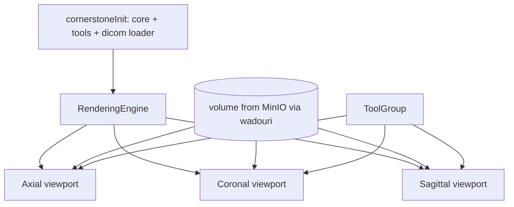

# 7. Viewer Architecture

The viewer is the heart of the workspace. 2D multiplanar reconstruction (MPR) uses
Cornerstone3D; volume rendering uses vtk.js. Both consume the same volume loaded from
MinIO.

## 2D MPR (Cornerstone3D)



- A `RenderingEngine` drives three viewports sharing one `volumeId`.
- A `ToolGroup` registers tools and switches the active primary tool.

## Tools

| Category | Tools |
|----------|-------|
| Navigation | Zoom, Pan, Window/Level, Stack/Slice scroll, Rotate |
| Measurement | Length, Angle, Rectangle ROI, Elliptical ROI, Probe |
| Annotation | Text/Arrow, Bounding box, Polygon (freehand), Brush, Eraser |

Tool state is held in `store/viewerStore.ts` (active tool, window/level preset, layout,
selected finding). Selecting a finding in the AI panel pans/zooms the relevant viewport to
its `bbox` and highlights its auto-annotation.

## AI overlays

- Segmentation masks render as Cornerstone3D `Segmentation` labelmaps with adjustable
  opacity per structure.
- Auto-annotations (`ai_generated=true`) load as annotation tool state; users can edit
  them, which creates/updates manual annotation rows via the API.

## 3D volume rendering (Cornerstone3D VOLUME_3D / vtk.js)

The `VolumePanel` renders a true GPU volume using a Cornerstone3D `VOLUME_3D`
viewport (vtk.js under the hood):
- Builds a volume from the same slice stack used by MPR.
- Applies a built-in transfer-function preset (CT-Bone, CT-Lung, CT-Soft-Tissue,
  CT-AAA, CT-Cardiac, MR-Default) via `viewport.setProperties({ preset })`.
- Interaction through a `ToolGroup`: **left drag = rotate (TrackballRotate),
  right drag = zoom, middle drag = pan**.

## Interaction model

Both the MPR panes and the 3D view are driven by Cornerstone3D `ToolGroup`s with
standard mouse bindings:

| Mouse | 2D MPR | 3D Volume |
|-------|--------|-----------|
| Left drag | active tool (W/L, Pan, Zoom, measure, annotate…) | Rotate |
| Right drag | Zoom | Zoom |
| Middle drag | Pan | Pan |
| Wheel | Scroll slices | — |

The toolbar's active tool (`store/viewerStore.ts`) maps to the left-button tool in
the MPR tool group; right-zoom / middle-pan / wheel-scroll stay bound regardless.

## Implementation status (current)

- `cornerstoneInit.ts` initializes the core, registers the `wadouri`/`wadors`
  DICOM image loaders (v1.x registers these as a side effect of assigning
  `external.cornerstone`; there is no `init()` helper), wires `dicomParser`,
  registers the streaming **volume loader**
  (`@cornerstonejs/streaming-image-volume-loader`), and initializes the **tools**
  layer (`@cornerstonejs/tools`) — registering pan/zoom/rotate/window-level/scroll
  plus the measurement & annotation tools.
- `MprViewer.tsx` builds a volume from the slice stack and renders true
  axial/coronal/sagittal orthographic viewports from one `RenderingEngine`, all
  added to a shared `ToolGroup`.
- `VolumePanel.tsx` renders a `VOLUME_3D` viewport with a transfer-function preset
  and a TrackballRotate/Zoom/Pan tool group.
- `SharedArrayBuffer` is explicitly disabled (`setUseSharedArrayBuffer(false)`)
  because the dev/preview pages are not cross-origin isolated; the volume loader
  falls back to plain `ArrayBuffer`.
- If volume construction fails, each MPR pane falls back to a 2D stack viewport so
  images always render.
- AI finding bounding boxes overlay as a non-interactive SVG layer (axial plane).

### Build note: Cornerstone + Vite

Two build-time workarounds live in `vite.config.ts`:

1. **Polyseg WASM stub** — `@cornerstonejs/tools` statically pulls in a
   surface↔labelmap WASM worker (`@icr/polyseg-wasm`) that Rollup cannot bundle.
   We don't use that feature, so the package is aliased to a no-op stub
   (`src/lib/polyseg-stub.ts`).
2. **UMD builds in production** — the ESM builds of `@cornerstonejs/core`,
   `tools`, and `streaming-image-volume-loader` have hundreds of circular
   dependencies that break Rollup's chunk ordering (runtime
   "Cannot access X before initialization"). For production builds these three are
   aliased to their `dist/umd/index.js` builds, the officially recommended
   workaround (cornerstone3D issue #742).

## Data path

```
instance.object_key (Postgres)
   -> presigned GET URL (MinIO)
   -> cornerstone dicom-image-loader (wadouri:)
   -> cached volume
   -> viewports + masks
```

## Performance notes

- Presigned URLs avoid proxying large pixel data through the API.
- Volumes cached client-side; progressive loading per slice.
- Target: PACS/DICOMWeb (WADO-RS) as an alternate image source later.
