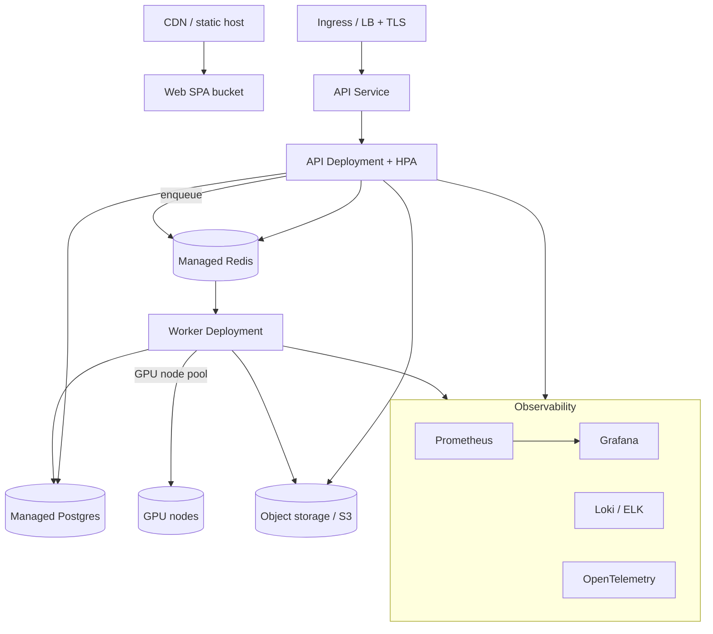

# 8. Deployment Architecture

## Environments

| Env | Infra | Purpose |
|-----|-------|---------|
| dev | docker-compose (this repo) | local full stack |
| staging | Kubernetes (small) | integration, QA, model eval |
| prod | Kubernetes (HA) | clinical-grade workloads |

## Target production topology (Kubernetes)

## Scaling strategy

- **API**: stateless `Deployment` + `HorizontalPodAutoscaler` on CPU/RPS.
- **Workers**: separate `Deployment`; CPU pool for I/O stages, **GPU node pool** for
  inference; KEDA autoscaling on Redis queue length.
- **Postgres**: managed, read replicas for reporting.
- **Redis**: managed/clustered (broker + cache + pubsub).
- **Object storage**: S3 / MinIO gateway; lifecycle rules for cold studies.
- **SPA**: static assets on CDN.

## Configuration & secrets

- 12-factor env vars; secrets via Kubernetes `Secret` / external secrets manager.
- Per-env values via Helm values files.

## High availability & DR

- Multi-replica API/worker, PodDisruptionBudgets.
- Postgres PITR backups; S3 versioning + cross-region replication.
- Stateless services -> rolling deploys with zero downtime.

## Security & compliance (healthcare)

- TLS everywhere; network policies; least-privilege service accounts.
- PHI encrypted at rest (DB + object storage) and in transit.
- Audit log (`audit_log` table) for every PHI access.
- See [13-production-strategy.md](13-production-strategy.md) for HIPAA/GDPR detail.

## Delivery

- Images built in CI, pushed to a registry, deployed via Helm by CD.
- Migrations run as a pre-deploy `Job` (Alembic). See [10-cicd.md](10-cicd.md).
