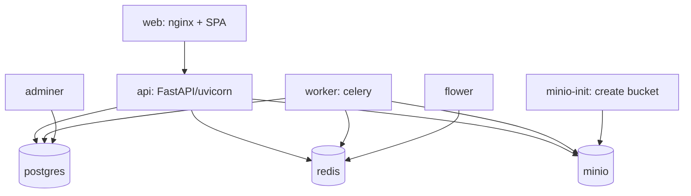

# 9. Docker Setup

The whole stack runs locally with one command:

```bash
cp .env.example .env
docker compose up --build
```

## Services



| Service | Image | Port(s) | Role |
|---------|-------|---------|------|
| web | built from `infra/frontend.Dockerfile` | 5173 | SPA via nginx |
| api | built from `infra/backend.Dockerfile` | 8000 | FastAPI |
| worker | same backend image, celery command | — | AI pipeline |
| postgres | postgres:16 | 5432 | database |
| redis | redis:7 | 6379 | broker/cache/pubsub |
| minio | minio/minio | 9000/9001 | object storage |
| minio-init | minio/mc | — | creates the bucket on boot |
| flower | mher/flower | 5555 | celery monitoring |
| adminer | adminer | 8080 | DB UI |

## Key details

- **Single backend image** for `api` and `worker` (different commands) — guarantees they
  share code/deps.
- **Healthchecks** on postgres/redis/minio; `api`/`worker` `depends_on` them with
  `condition: service_healthy`.
- **Auto-migrate + seed**: `infra/entrypoint.sh` runs `alembic upgrade head` then seeds the
  admin user before launching uvicorn.
- **Volumes**: named volumes persist Postgres and MinIO data across restarts.
- **Env**: all services read from the root `.env`.

## Dockerfiles

- `infra/backend.Dockerfile` — slim Python base, installs the `backend` package, includes
  system libs needed by WeasyPrint (pango/cairo) and imaging libs.
- `infra/frontend.Dockerfile` — multi-stage: `node` build -> `nginx` static serve using
  `infra/nginx.conf` (SPA fallback + API proxy).

## Common commands

```bash
docker compose up --build            # start everything
docker compose logs -f api worker    # tail logs
docker compose exec api alembic upgrade head
docker compose down -v               # stop + wipe volumes
```
