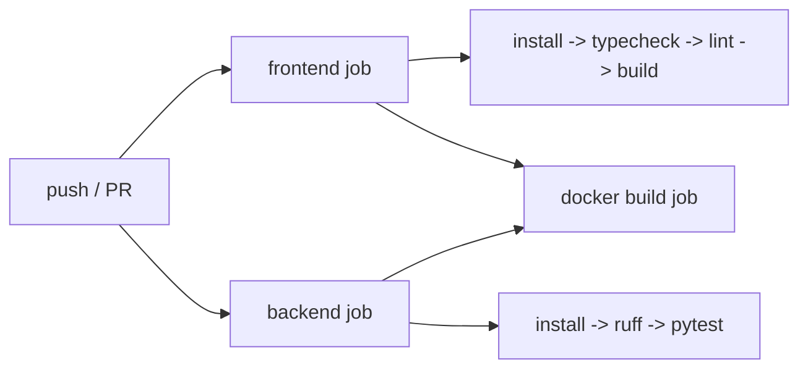
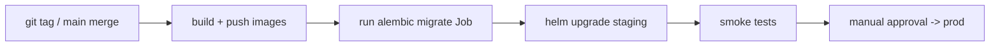

# 10. CI/CD Pipeline

GitHub Actions. CI runs on every push/PR; CD (documented, gated) builds and ships images.

## CI pipeline

### Frontend job
- `npm ci`
- `npm run typecheck` (tsc, no emit)
- `npm run lint` (eslint)
- `npm run build` (vite)

### Backend job
- Python 3.11, `pip install -e ".[dev]"`
- `ruff check .`
- `pytest` (includes the pipeline smoke test with the stub engine; Postgres + Redis as
  service containers)

### Docker build job
- Builds `infra/backend.Dockerfile` and `infra/frontend.Dockerfile` to validate they
  build (no push on PRs).

The workflow lives in `.github/workflows/ci.yml`.

## CD pipeline (target)

- Images tagged with git SHA + semver.
- DB migrations run as a Kubernetes pre-deploy `Job`.
- Progressive delivery (canary / blue-green) for the API.
- Rollback = `helm rollback` + previous image tag.

## Quality gates

- PRs blocked unless CI green.
- Conventional commits + changelog (recommended).
- Dependency scanning + image scanning (Trivy) in the CD path (documented).
